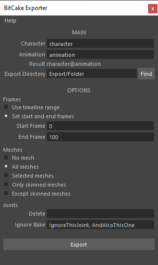

# Install Instructions

1. Copy the downloaded `maya/` folder into your preferences folder:
    - Windows: `Documents/maya/`
    - MacOS: `Library/Preferences/Autodesk/maya/`
1. Open up the script editor in Maya and type (on the mel tab):
    ```
    source "bitcake_exporter";
    bitcake_exporter_install;
    ```
1. Two buttons will be automatically created on your current shelf with the correct Icons.

# How to Use



## Main

**Character** | The character part of the exported fbx filename
**Animation** | The animation part of the exported fbx filename
**Export Directory** | The directory where the exported fbx file will be saved on

*The resulting filename will be `<character>@<animation>.fbx`

## Options

### Frames

**Use timeline range** | All frames in the entire timeline will be used when exporting
**Set start and end frames** | Only frames inside `Start Frame` and `End Frame` frames will be used when exporting

### Meshes

**No mesh** | Only joints and animation data will be exported
**All meshes** | All meshes in the scene will be included in the export
**Selected meshes** | Only selected meshes will be included in the export
**Only skinned meshes** | Only skinned meshes will be included in the export
**Except skinned meshes** | All meshes except skinned meshes will be included in the export

### Joints

**Delete** | All joints that include these tags (separated by `,`) will be deleted on export
**Ignore Bake** | All joints that include these tags (separated by `,`) won't be baked to the exported animation

---

*These fields are saved to the scene file. By doing so, it is not needed to retype them everytime the exporter is opened.*
